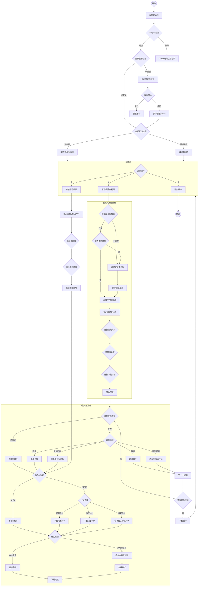

# BiliFAV 程序流程图

## 完整程序逻辑流程图

## 流程图说明

### 主要模块

1. **初始化模块**
   - FFmpeg检测
   - 登录状态检查
   - 会员权限检测

2. **主菜单模块**
   - 下载收藏夹视频
   - 直接下载视频
   - 退出程序

3. **收藏夹下载模块**
   - 数据库缓存管理
   - 收藏夹列表显示
   - 清晰度选择
   - 下载路径设置

4. **下载处理模块**
   - 文件存在检查
   - 覆盖选项处理
   - 多分P视频处理
   - 音视频合并

### 关键特性

- **智能缓存**：使用SQLite数据库缓存收藏夹数据
- **断点续传**：支持从上次中断处继续下载
- **批量操作**：支持覆盖所有/跳过所有操作
- **多分P处理**：智能检测和处理多分P视频
- **后台合并**：异步处理DASH格式音视频合并

### 错误处理

- FFmpeg未找到错误处理
- 登录失败重试机制
- 网络异常处理
- 文件操作异常处理

## 技术架构

该流程图展示了BiliFAV程序的完整逻辑流程，体现了以下技术特点：

- **模块化设计**：各功能模块独立且可复用
- **异步处理**：后台合并不影响主下载流程
- **用户友好**：提供清晰的交互界面和选项
- **容错性强**：完善的错误处理和恢复机制

流程图使用标准的Mermaid语法，可以在支持Mermaid的Markdown查看器中正确渲染。